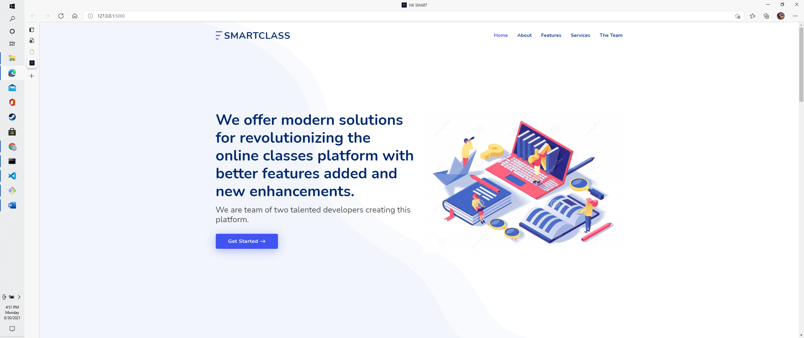

# SMARTCLASS
Hi everyone we have created a small prototype where we provide a multiple service like automatic feedback analysis of the lecture and the application apart from that we have also added a video based transcript and summary generator to understand about the lecture too navigate through the application we provide a chatbot also . For getting the audio from the video part and generating a transcript we have used Symbl api.
* Run the app.py file
* Open the webpage in a browser.
*	You will be redirected on all the links as you scroll through it.
* In the services section you can find all the different services we created.
* Run the chatbot service firstly to get a better idea about the tools.
*	Then for the video summarization service; firstly open a page with ‘route’/admin and there upload a video of your choice for transcript and summary.
*	After the uploading process is complete you will redirected to the video summarization page and the uploaded video will be stored in “Lecture id-01” and below that you will find a button of Transcript & Summary, clicking on it will lead you to the transcript and summary for the respective uploaded video.
*	Post that You can check the customer feedback analysis, which is our third offered service.
*	Therein filling a form and based on the details filled the feedbacks sentiment will be analyzed and will provide a count for it being a positive or a negative feedback and the count will be updated in real-time and all the responses will be stored in our cloud database, MongoDB.
*	Below the services section there is a The Team section providing information about the members and below that is a contacts section providing our contact details.

